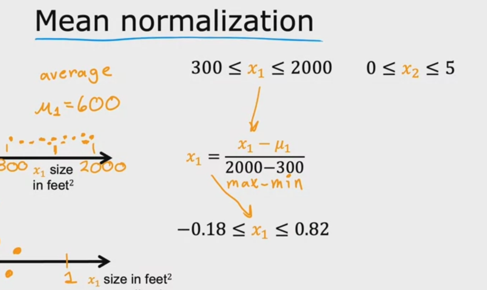
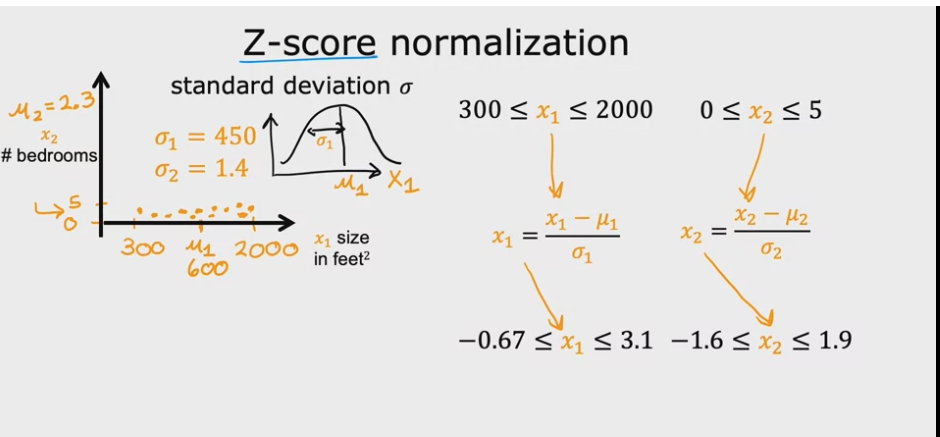

Supervised learning - learns from being given "right answers"
Regression - predict a number infinitely many possible outcomes (categories)
Classification - predict a finite output

Unsupervised Learning - no labels y, we don't kno

Training Set - Data used to train the model
x input - feature
y  output - target
m - numver of training examples
(x, y) = single training example
(x^i, y^i) = ith training example (1 row) - not exp duhhh

linear regression

 + y_hat = estimate
 + y = target

 + f(x) = wx + b

 + 1 variable = linear w

cost function 
 + how well the model is doing
 + y_hat - y = error, how har off

 + (1/2m)sum(i...m)(y_hat -h)^2 - cost function (squared error cost function)

  + goal is to minimize J(w,b) - essentially make the difference near 0

Gradient Descent - minminze cost
 + w = w - alphaa * d/dxJ(w,b)
 + alpha - learning rate (if too small then the alg. will take too long, if too large, we can overshoot)
 + d/dxJ(w,b) - learning rate (size of steps and direction we go)
  + repeat until convergence

Batch GD - each step of gd uses all the training examples

Multiple Features GD - Take in multiple features of X (multtiple inputs)
+ x (j, i) - jth feature, ith training example
+ f w,b (x) = w1x1 + w2x2 + w3x3 + w4x4 + b = w . x + b (dot product)
+ W and X are row vectors in this case

Feature Scaling - 
+ typically the larger the feature, the smaller the w
+ reduce all x ranges (x js) to be be between 0, 1
+ mean normalization - find average
+ z score normalization - 

Is it converging?
+ chooose an epsilon value that is near 0 in case the convergence ever occurs at exactly 0

Chossing Learning Rate
+ 

